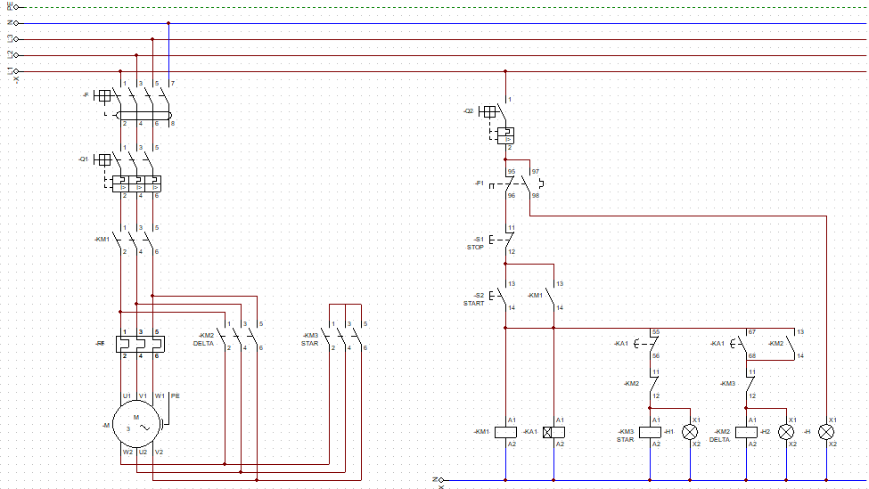
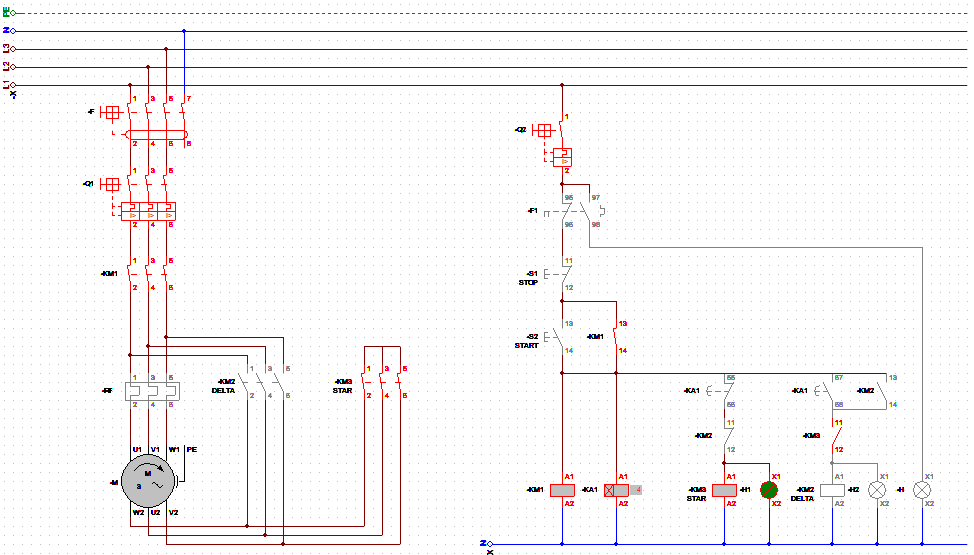
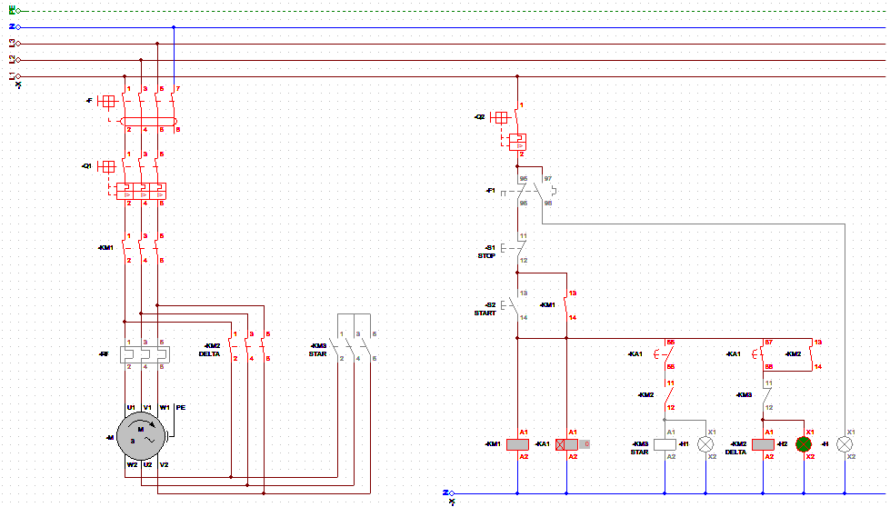
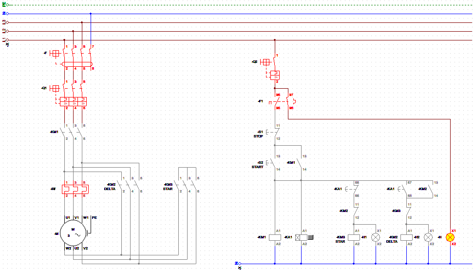

# Star-Delta-Motor-Starter-with-a-Timer
The Star-Delta starter is a method commonly used for starting large three-phase induction motors. It reduces the inrush current (starting current) by initially connecting the motor windings in a "Star" (Y) configuration during startup and then switching to a "Delta" (Δ) configuration for normal operation.

## Purpose
1. Reduce Starting Current: Directly starting large motors can draw very high currents (6 to 8 times the full-load current), potentially damaging electrical systems or tripping breakers.
2. Protect Electrical Components: Reduces stress on electrical panels, contactors, and cables.
3. Cost-Effective Starting: Compared to other soft-start methods, the Star-Delta starter is relatively simple and economical.

## Working Principle
1. Star Connection (Startup Mode):
   - In the Star configuration, the motor windings receive a reduced voltage (approximately 58% of the line voltage).
   - The current drawn is reduced to about one-third of what it would be in Delta mode.
   -  Torque is also reduced to one-third of the full torque.
   -  Used during the initial phase when the motor starts to avoid high inrush currents.

2. Delta Connection (Running Mode):
   - Once the motor reaches approximately 70-80% of its rated speed, the starter switches to Delta mode.
   - In this configuration, the windings receive the full line voltage.
   - The motor can now produce its full rated torque and operate under normal conditions.

## Circuit Components
1. Differential Switch III
2. Magnetothermic Switch III
3. (3) Contactors
4. Thermal Relay
5. Magnetothermic Switch I
6. Timer
7. (3) Lamp Indicators
8. Start/Stop Push Buttons

## Connections
### Star Connection
- In Star configuration, one end of each of the three windings is connected together to form a neutral point.
- The other ends are connected to the three-phase supply.
- Voltage across each winding = Vline/ rad(3).

### Delta Connection
- In Delta configuration, the windings are connected end-to-end in a closed loop.
- Each phase of the supply voltage is applied directly across one winding.
- Voltage across each winding = Vline.

## Schematic

This schematic shows the power and control circuit.

## Advantages
1. Reduced Starting Current: Prevents sudden voltage drops in the system.
2. Simple and Economical: Low-cost solution for starting large motors.
3. Widely Used: Common in industries where large induction motors are used, such as pumps, fans, and conveyors.

## Disadvantages
1. Torque Reduction: Starting torque is only one-third of the full torque, which may not be sufficient for heavy loads.
2. Sudden Transition: The switch from Star to Delta can cause mechanical and electrical transients.
3. Fixed Time Delay: If the timer is not correctly set, it may switch to Delta too early or too late.

## Applications
- Pumps
- Compressors
- Fans
- Conveyors
- Other industrial applications where reduced inrush current is essential.

## Practical Considerations
1. Timer Setting: Proper tuning of the timer is crucial to ensure smooth transitions and avoid mechanical shock.
2. Motor Suitability: The Star-Delta method is effective for motors designed for Delta operation but may not suit all motor types.
3. Voltage Rating: Ensure the motor’s voltage rating matches the supply voltage to avoid underperformance or damage.

## Simulation Result

-  Startup Mode: Star Contactor

- After 5 seconds the Delta configuration takes place:

- In case of Overload:

